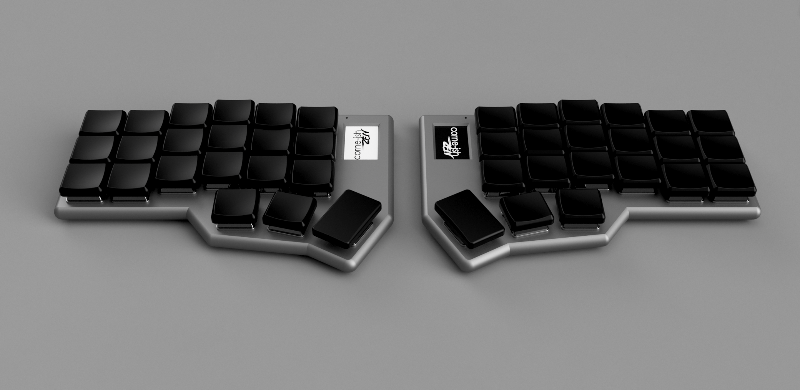
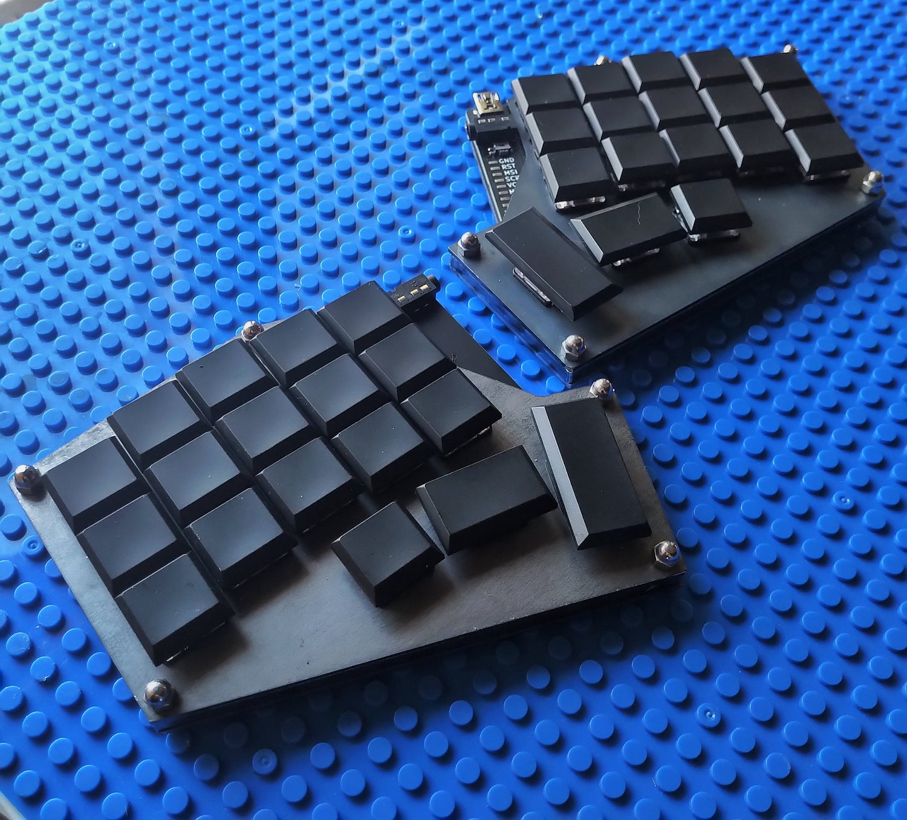
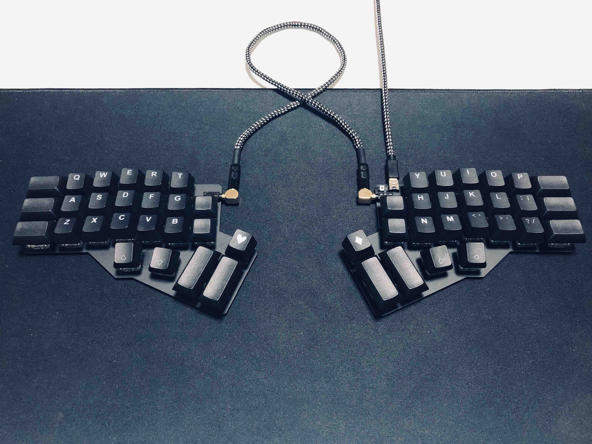
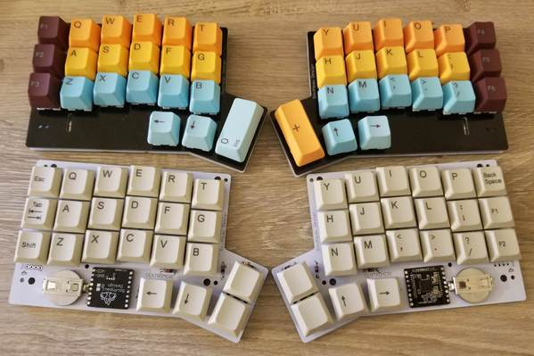
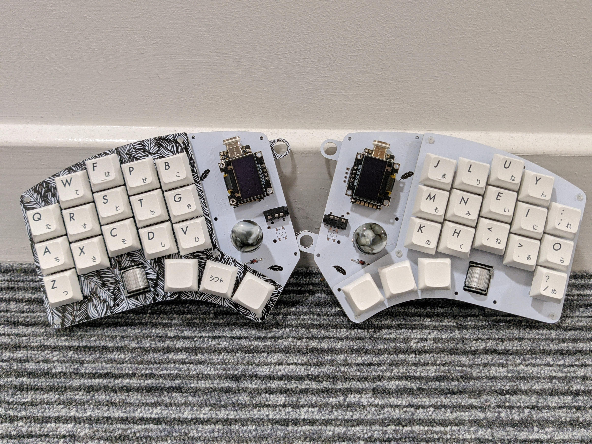
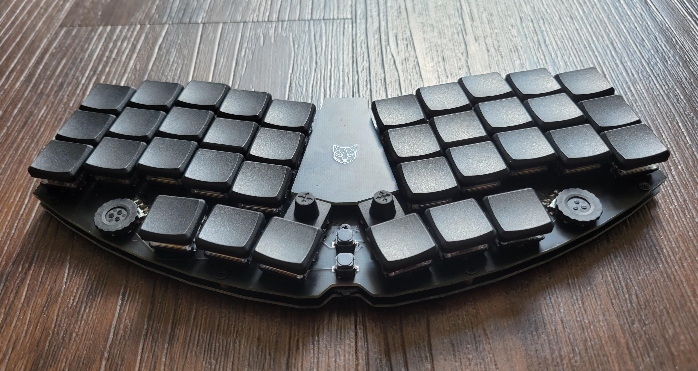
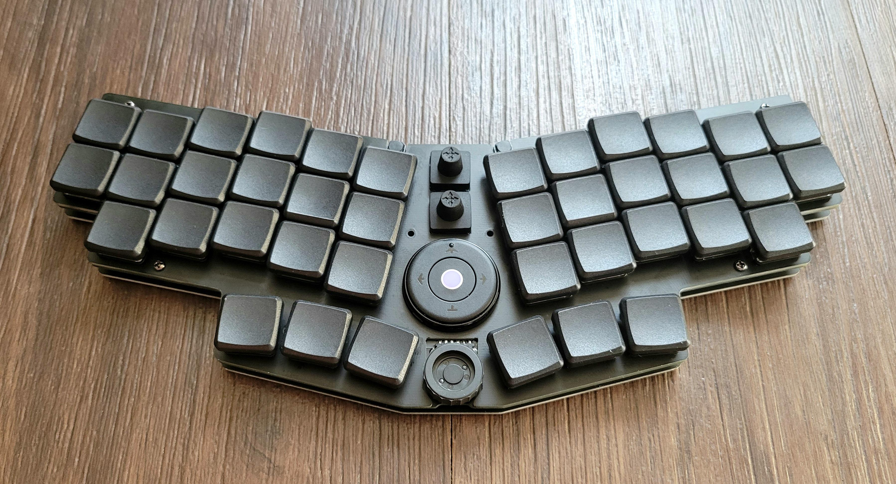
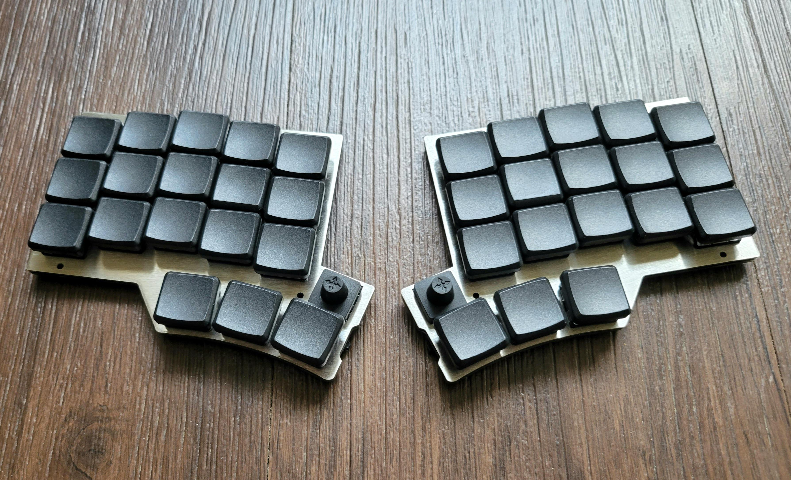

# Fiveday Keyboard 

Fiveday keyboard is a custom ergonomic split mechanical keyboard. 

## Roadmap / Feature list

- [ ] 3x6 column staggered keys and thumb cluster
- [ ] [QMK supported microcontroller(s)](https://beta.docs.qmk.fm/developing-qmk/c-development/compatible_microcontrollers) 
- [ ] Direct mapped pins, shift-register or IO expander to eliminate need for matrix diodes
- [x] Built-in controller for lowest profile 
   - Dropped, in favor of hassle free plug-in and more easliy repairable/upgradable socketed MC
- [x] USB-C connector
  - Comes with the controller
- [ ] Choc hotswap sockets for low cost and profile
- [ ] BLE 
- [ ] Trackpad, trackpad or joystick-like for thumbs 
- [ ] 3D printed case
- [ ] Magnets on halves
- [ ] RGB lighting support 

## Parts 

- [ ] PCB
   - [ ] Microcontroller footprint and schematic
   - [ ] Shift-register or IO expander to eliminate need for matrix diodes
      - MCP23018 
      - PCA9505
   - [ ] Layout
   - [ ] TRRS and temp bridge
   - [ ] Switch footpring and schematic
      - https://github.com/perigoso/keyswitch-kicad-library
      - https://github.com/daprice/keyswitches.pretty
- [x] Rigid USB-C connector
  - Comes with the controller
- [ ] Voltage regulator 
- [x] [Microcontroller](https://beta.docs.qmk.fm/developing-qmk/c-development/compatible_microcontrollers) 
  - Seeed XIAO RP2040 https://www.seeedstudio.com/XIAO-RP2040-v1-0-p-5026.html
  - Waveshare RP2040-Zero mini https://www.waveshare.com/wiki/RP2040-Zero
  - Pimoroni Tiny 2040 https://shop.pimoroni.com/products/tiny-2040
  - Adafruit QT Py RP2040 https://learn.adafruit.com/adafruit-qt-py-2040/downloads
- [ ] Boot and reset buttons
- [ ] BLE module (battery connector)
- [ ] Switches MX/Choc
- [ ] Switch sockets
- [ ] Trackpad, trackpad or joystick-like for thumbs 
- [ ] 3D printed case design

## Firmware 

Fiveday will most likely use the [QMK firmware](https://qmk.fm/)

## Inspiration 

### Keyboard Inspiration

#### [MiRage Modular Keyboard](https://github.com/zackfreedman/mirage)

#### [Sofle](https://github.com/josefadamcik/SofleKeyboard)

#### [Corne](https://github.com/foostan/crkbd)

#### [Gergoplex](https://www.gboards.ca/product/gergoplex)

#### [Gergo](https://www.gboards.ca/product/gergo)

#### [Centromere](https://southpawdesign.net/products/centromere-group-buy?variant=31652176232508) and it's [wireless variant](https://southpawdesign.net/products/centromere-wireless-keyboard?variant=8868004724796)

#### [SeveredDuck36](https://github.com/JW2586/SeveredDuck36)

### Keyboard Modification Inspiration

#### [Crkbd Hotswap Trackpoint](https://github.com/manna-harbour/crkbd/blob/master/trackpoint/readme.org) and the [Hotswap Trackpoint Builds List](https://github.com/manna-harbour/crkbd/issues/1)

#### [Pimoroni Trackball integration with Sofle Keyboard v1.1 and v2.1](https://github.com/foureight84/sofle-keyboard-pimoroni/blob/master/README.md)

#### [Gergo with a thumbstick](https://old.reddit.com/r/ErgoMechKeyboards/comments/h907fn/gergo_with_a_thumbstick_finally/)

#### [Modular low profile ergo keyboard with built-in USB hub](https://old.reddit.com/r/ErgoMechKeyboards/comments/ownjxm/modular_low_profile_ergo_keyboard_with_builtin/)

This particular keyboard is a derivative of the Peregrine keyboard (although that keyboard is wireless and this one, the Peregrine ZH, is not).

The keyboard itself features some unique items that set it apart: a set of 5-way switches that are directly accessible for use by the thumb, allowing for the user to either have a much more robust set of modifiers immediately available or allow for the use of numbers without having to resort to additional layers. In combination with the tact switches, this makes input for many things faster than would otherwise be possible with a configuration that isn't as compact. There is also a rocker switch and two encoders that can be used for navigation or media functions.

The other unique thing about this keyboard is that it uses magnets to hold the center add-on board in place. The one shown in this image is placeholder, but underneath it is held on with a set of magnets and modular connectors so it's easy to change out while still having strong connections to the main board while still in use.

There are a few extra MCU pins broken out (I2C and analog pins) so that you can use things like an OLED display. However, the real neat part here is that one of the on-board USB hub's ports is connected to one of the modular connector ports. This means that the add-on module can be an entirely separate USB device that is capable of being individually programmed. This makes it easier to keep the keymaps that you like, while making it easier and faster to integrate new add-on module functionality. It also means that a single keyboard could be running some combination of ZMK, QMK, CircuitPython, Arduino, or whatever your favourite way to code and interact with electronics is - all concurrently, all at the same time.

[Southpaw hardware repo](https://github.com/spe2/southpaw_hardware)

#### [Peregrine, a wireless ergonomic board with a built in trackpad module that can be removed and used separately.](https://old.reddit.com/r/MechanicalKeyboards/comments/oiwj54/made_peregrine_a_wireless_ergonomic_board_with_a/)

The trackpad module is actually a ProLab mouse, which was a kickstarter. It uses a trackball module that is similiar to the ones you've surely seen popping up around here, but is self contained and has a few additional buttons and acts as fully independent mouse. It's a low tech way to integrate pointing functionality into a ZMK keyboard - it's simply attached with some velcro, so you can pull it out and use it separately.

Otherwise, the board has a Pro Micro compatible footprint because I've got so many compatible boards that are both wired and wireless, so it makes it easy to throw in whatever controller.

As with pretty much all of my boards lately, it's hot swappable, low profile, and uses Choc spacing for the sake of compactness. I'm using the two five way switches and the small black tactile buttons you see in the top middle section as its own number row. The bottom middle piece is a low profile jog wheel rotary encoder.

[Southpaw hardware repo](https://github.com/spe2/southpaw_hardware)

#### [Wireless low-profile Centromere Mini that lasts for months with a coin battery. This variant has a few extra tricks. ](https://old.reddit.com/r/MechanicalKeyboards/comments/ogh8pc/wireless_lowprofile_centromere_mini_that_lasts/)

It's a brand new variant of the Centromere Mini with a few new tricks up its sleeve. Namely, a few tweaks in pinky stagger and thumb cluster arrangement. There are 5 way switches to add a bunch more options in the keymap as to what goes on the base layer.
What is a new part for me is this 3 way rocker switch - it rotates clockwise and counterclockwise. And you can also push it in. With a bottom plate or case elevating the board a bit, it makes an excellent way to mimic encoder functionality without making the board any bigger, and entirely avoids the current leakage many common cheap encoders have that can negatively affect battery life.

[Southpaw hardware repo](https://github.com/spe2/southpaw_hardware)

## Keyboard Design and PCB Resources

[DIY Keyboard from Scratch - with QMK and ATmega32U4 by Datulab Tech](https://youtu.be/dpd4y-xZGN0)

[Custom 3D Printed Split Keyboard by Jan Lunge](https://youtu.be/WmjB4KrfuN0)

[How we designed a mechanical keyboard PCB! by KoBuss](https://youtu.be/ezk02GJ9iMs)

[PCB Desing Video Series by hadi](https://www.youtube.com/watch?v=BhFqkVggv8Q&list=PLbtY7JsOJDYkHNuTmBtGgaWv_qipKeL-u)

[Keyboard matrix explained](http://blog.komar.be/how-to-make-a-keyboard-the-matrix/)

[Making our own Macro Keyboard - Designing our own PCB](https://youtu.be/qcEJ3mDn-Nk)

[KiCad PCB Generator quick demo](https://youtu.be/58UxCL_o66E)

[From Idea to Schematic to PCB - How to do it easily!](https://youtu.be/35YuILUlfGs)

[Creating your own custom hardware (printed circuit boards)](https://youtu.be/9zU92H_CLVI)

[How To Make A Custom PCB From Design To Assembly](https://youtu.be/JCmg-18BxTU)

[Keyboard PCB Guide](https://github.com/ruiqimao/keyboard-pcb-guide)

[Keyboard designer wiki](https://wiki.ai03.com/)

[Handwiring guide](https://wiki.geekhack.org/index.php?title=Hard-Wiring_How-To)

[Awesome Electronics](https://github.com/kitspace/awesome-electronics)

[Split keyboard layout comparison](https://jhelvy.shinyapps.io/splitkbcompare/)

[KLE](http://www.keyboard-layout-editor.com/)

[Plate & Case Builder](http://builder.swillkb.com/)
